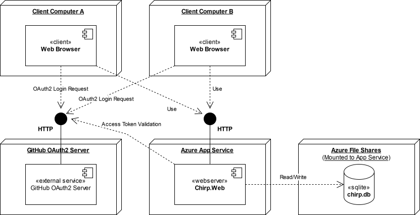
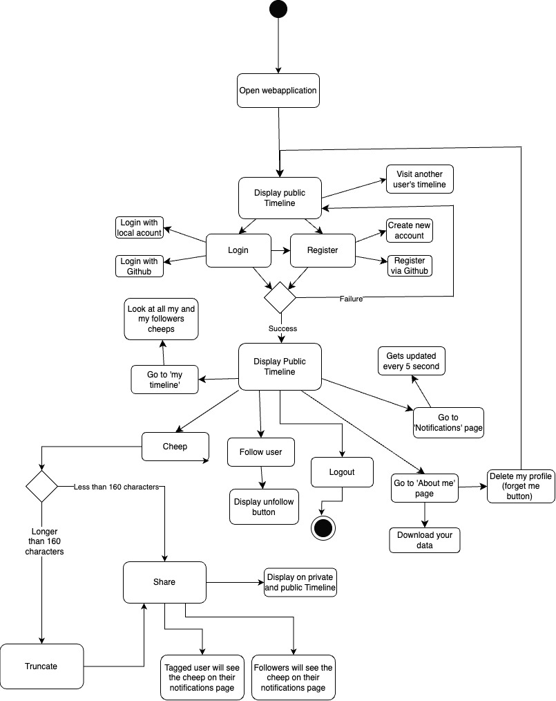

# Design and Architecture of _Chirp!_

## Domain model

Here comes a description of our domain model.

_Chirp_ has three entities: Author, Cheep, and Notification. Using Entity Framework Core (EF Core), these entities are mapped to tables in a SQLite database, and LINQ queries are used to interact with the database.
- An `Author` represents the user of the application. It inherits from ASP.NET IdentityUser, which handles user authentication and authorization. Each author has a unique username and the ability to follow other authors.
- A `Cheep` is a message that an author can post. A timestamp is added to each cheep when it is created as well.
- A `Notification` is sent to all followers of a cheep's author when it is posted. If an author is tagged in a cheep by starting it with `@<Username>`, a notification is sent to the tagged author as well.

Each entity has a corresponding repository class responsible for reading and writing to the database.
Additionally, each entity has a corresponding DTO (Data Transfer Object) to transfer only the necessary data to the presentation layer.

  

## Architecture — In the small

As the illustration shows, the _Chirp!_ application is organized using the onion architecture.
This pattern has the benefit of making the code highly modular. The dependencies exclusively go inwards,
meaning that the inner layers are not dependent on the outer layers. This makes it easy to replace layer implementations, allowing for a high degree of flexibility and testability.

- Core:
  - At the core are the entities of the domain model. That is the `Cheep`, `Author`, and `Notification` classes. Their respective DTO's also reside in this layer.
- Second layer:
  - In the second layer, we have our repositories, which are responsible for reading and writing to the database. Each domain model has one repository. Additionally, we have a `DBRepository`, which is responsible for general database operations that are not tied to a specific domain model. Currently, it includes two methods, one for seeding the database and one for resetting it.
- Third layer:
  - The `CheepService` resides in the third layer and is responsible for the business logic of the application. All the razor pages have a reference to an instance of the service. Calling it `CheepService` instead of `ChirpService` is a bit of a misnomer, as it also handles the business logic for the `Author` and `Notification` entities. However, we wanted to maintain the same name as in the project description.
- The outermost layer: 
  - The presentation layer, which includes the Razor pages, controllers, and the `program.cs` file. This layer is responsible for tying everything together and rendering the UI. 

## Architecture of deployed application

Our backend architecture consists of two components we host on Azure, as well as an external authentication provider (Github). The server components are:
- An Azure App Service instance running our Chirp.Web application
- An Azure File Share where we host our database, to enable persistance and let it scale to more than the 1 GB provided by Azure App Service. 
  - The File Share is mounted to the app service and the app service has been granted read and write permissions to the File Share. 
  - The File Share contains a `chirp.db` file, which is a Sqlite3 database. 
  - On deployment, the App Service executes a `startup.sh` script, which attempts to run a provided migration bundle against the `chirp.db` file. If there are no new migrations/no changes to the database schema, nothing happens. If there are changes, the database schema is updated. We have a *Migration test* that tests this scenario. 

Clients communicate to our server via HTTP requests, where they can ``GET``:
- The pages (endpoints) of the application
- Notifications (if authorized)  

and can ``POST``: 
- Cheeps 
- Authorization requests(logging in) 
- Requests to follow other authors 
- Requests to download or delete their user data. 

Users can also log in via a third-party service, GitHub. Under the hood, the process is as follows: 
1. The user clicks the "Log in using your GitHub account" button, which redirects them to GitHub's authorization servers.
2. Here they authenticate themselves via their GitHub account.
3. They are then redirected back with an access token.
4. Our server then returns this token to the GitHub authorization server.
5. If the token is valid, then the GitHub server sends back the user's GitHub username and email
6. If the account is not already in our database, then one is created. The user is then automatically logged in and redirected to the (logged-in) public timeline 
4. Our server then sends this token back to the GitHub authorization server.
5. If the token is valid, the GitHub server sends back the user's GitHub username and email.
6. If the account is not already in our database, one is created. 
7. The user is then automatically logged in and redirected to the (logged-in) public timeline 

## User activities

The typical scenarios of a user journey through our _Chirp!_ application are displayed in the diagram above. The potential user journey begins with visiting the site. An unauthorized user can only view the public timeline and other authors timelines. If the user registers or logs in, they can send cheeps, follow authors, view their private timeline, download their data, and more. 

## Sequence of functionality/calls through _Chirp!_
 
The following UML diagram illustrates the flow of messages through the Chirp! application. Although it isn't shown explicitly on the diagram, the sequence of calls begins with an unauthorized user requesting to see the default public timeline page and ends with the same user receiving the fully rendered web-page. 

# Process

## Build, test, release, and deployment

Note: We have taken the liberty of making the lines from negative conditions red to make the diagram more readable, considering that there is a considerable number of points of failure. In addition, some repetitive steps (like checking out the repository, cleaning up, etc.) have been omitted.

Note that the diagram doesn't include the release process, since it wasn't a part of the process at the time of writing (Essentially we let Chirp be a web-only application). 

In our case a successful deployment requires four parallel processes to all succeed, where three of these are tests. In the diagram, these sub-processes are marked within the larger *Deploy to Azure* process. They are, from left to right:
- Test Migration: 
  - This workflow ensures that any possible migrations the deployment might want to apply to the production database won't break anything, by mimicking the migration 1:1. Obviously, this would be unfeasible in a larger application with a database of many terabytes; here, you would instead create a database with an identical schema and seed it with a small, representative sample of the real database.
  - This is important as we have one *persistent* database across Chirp's entire lifetime, instead of just pushing a *chirp.db* file with every deployment (thus resetting the database on every deployment, which seemed undesirable). 
- Unit/Integration tests: 
  - By far the simplest of the test workflows. Here, we just figure out what test projects exit (omitting UI tests since they require a lot of additional setup) and then run those test projects in parallel. 
- UI Tests: 
  - The bulk of this workflow is in setting up for the UI tests. The way they are implemented, the test runner expects an up-to-date Chirp.Web binary in its own `bin` folder. The containing binary is what will be tested, so for accurate tests we have to make sure we export the newest version of `Chirp.Web`. 
  - In addition to that, Playwright just has a lot of large dependencies (Powershell and several browsers, which we cache since they take up ~500MB) that aren't installed by default on the GitHub actions machines. 
- Deployment Setup: 
  - Here we build the `Chirp.Web` project binaries that we want to deploy as well as the bundled migration we (might) want to apply to the production database. Note that we always push a bundle, even if there are no new migrations to apply. In that case, nothing happens when you try to apply the migration on the server. Naturally, we can't deploy if we fail to generate either of these artifacts, but this step should usually succeed. 

If a single step fails, the entire workflow fails, and nothing will be deployed. 

### Issues/Points of improvement 
There are a few instances of redundancy in the workflow. The worst offender is probably the fact that we generate the exact same migration bundle and `Chirp.Web` binaries twice; once for testing and once for the actual deployment. Redundancy in setup dotnet is immaterial considering how little time that action usually takes to execute. 

The reason for this redundancy is that the three test workflows of the deployment workflows are, in GitHub actions, an entirely different workflow that is called on every push to every branch. The deployment workflow simply calls this workflow and has the actual deployment action depend on its success. 

Additionally, this also means that every push on main has the same tests run on it twice; the test workflow is triggered once directly by the push and once by the deployment workflow. 

The double generation of the migration bundle and `Chirp.Web` binaries could be solved by having the binaries as an output of the Test workflow and input of the Deployment workflow. The double running of the tests could be solved by either having the test workflow explicitly only trigger on *non-main* branches or by having the deployment workflow query if a successful test run on the same commit exists. 

## Team work
Below is an image of our project board on GitHub right before hand-in. As seen in the picture, there are unresolved issues. The unresolved issues are from the wild style week and weren't implemented due to focusing on higher priority issues based on the project requirements or time constraints. On the project board, it can be seen that each issue is assigned to one or more team members. 

When issues were created, a team member(s) was assigned and was therefore responsible for it. The responsible person created a branch and started working on the issue. Once an issue was completed and tested, the assigned person submitted a pull request, which was subsequently reviewed by another team member who hadn't worked on the specific issue. This was an iterative process, meaning that if the PR was not approved or failed tests, the assigned person would continuously improve it until it was approved, in which case the issue would be moved to ‘Done’ on our project board.

## How to make _Chirp!_ work locally
How to Git Clone and Run the Program: 

1. Open a new terminal window at the preferred directory and run the following command: 
`git clone https://github.com/ITU-BDSA2024-GROUP26/Chirp.git`

2. Navigate to the Web project: 
`cd Chirp/src/Web`

3. Once in the Web directory, run the program: 
   - If login with GitHub is wanted, then set the user secrets before running the program:
         `dotnet user-secrets init`

   - To run the program on Windows, write following command: 
    `& { $env:ASPNETCORE_ENVIRONMENT = "Development"; dotnet run }`

   - To run the program on macOS or Linux, write following command: 
    `ASPNETCORE_ENVIRONMENT=Development dotnet run`

Once the build has finished, this line should be visible containing a link to the localhost:  
`Now listening on: http://localhost:5273`

Clicking on the link will direct to the locally run Chirp! application. 

## How to run test suite locally

_Chirp!_ includes three test suites:

- Repository.Tests
   - The Repository.Test folder contains unit and integration tests for the functionality of the repository classes within the Chirp application. 

- Service.Test
   - The Service.Test folder contains unit and integration tests for validating the functionality of the `CheepService` class within the Chirp application.

- Web.UITest
   - The Web.UITest folder contains UI tests that were made using Playwright. The UI tests, test whether a user can perform the various actions possible in Chirp and if the result of those actions is what we expect.
   - In order to make the test isolated, we made an API that is only active when in the `Development` environment, which allows us to reset and seed the database after every test.
     - Alternatively, we could have started multiple instances of the application and run the tests in parallel, but this would have been more complex and potentially slower as every test needed to start its own server. 

Before you can run the unit tests you need to have PowerShell installed and Playwright browsers and other dependencies in your `Web.UITest/bin/` folder.

How to install PowerShell(if not already installed):

1. Linux: `sudo apt update && sudo apt install \-y powershell`

2. MacOS: `brew install \--cask powershell`

3. Windows: You can skip this step if you are using PowerShell. 

How to install Playwright browsers:

1. Go to the root directory of the project

2. Run `dotnet build`

3. Run the following command: `./tests/Web.UITest/bin/Debug/net8.0/playwright.ps1 install`

How to run test suite locally:

1. Go to the root directory of the project

2. Ensure the setup script has execute permissions  (on Linux/MacOS)

    1. Run the command: `chmod +x scripts/setup_UI_tests.sh`

3. Run `scripts/setup_UI_tests.sh`
   - This script builds the UITest project (so we are sure that a relevant `/bin` folder exists), then builds and publishes `Chirp.Web` into that folder such that the UI-tests can launch a local instance of the app to run the UI tests against. 
   - Note that if you installed playwright browsers in the previous step building the UITest project is redundant, but it allows us to just run this script and then `dotnet test` as long as the playwright browsers etc. Stay in the `/bin` folder.  

4. Run the tests by using the command: `dotnet test`

# Ethics

## License
We have chosen the standard MIT License for its simplicity and widespread use. The license is commonly used with the .NET, which is the main platform we are working with.

## LLMs, ChatGPT, CoPilot, and others
During the development of our project, we used the following LLMs: ChatGPT and GitHub Copilot. ChatGPT was primarily used when we needed clarification, a better overview, boilerplate code or help understanding specific errors and bugs that we couldn't resolve within the group. It assisted us through the project development with issues and questions, where the textbook material wasn't enough to guide us. On the other hand, Copilot was more code-specific, directly assisting us in writing and completing code.

Both of the LLMs improved our productivity by saving time on repetitive tasks, such as generating boilerplate code or rewriting previously written code by the group.  The biggest disadvantage we noticed when using ChatGPT, was that we had to be careful with our prompts and know exactly what we wanted to ask, to receive relevant and helpful responses. At times, especially for obscure code-related issues, ChatGPT's answers weren't helpful, requiring us to either rephrase our questions, or simply not rely on ChatGPT for that issue.

