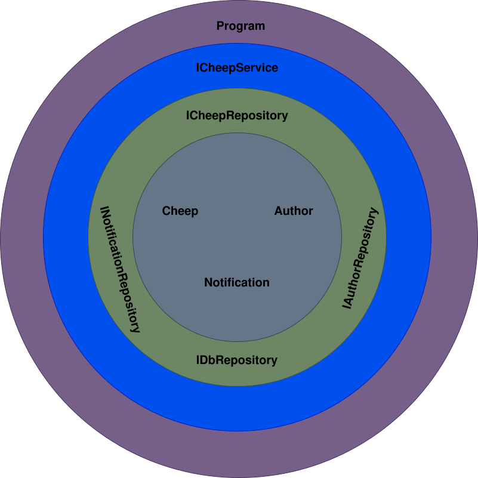
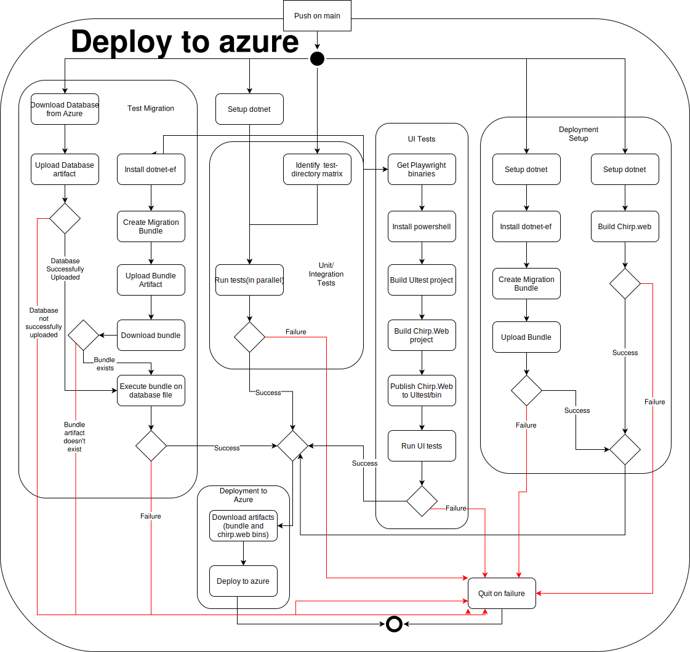

# Design and Architecture of _Chirp!_

## Domain model

_Chirp_ has three entities: Author, Cheep, and Notification. Using Entity Framework Core (EF Core), these entities are mapped to tables in an SQLite database, and LINQ queries are used to interact with the database.
- An `Author` represents a user of the application. It inherits from ASP.NET IdentityUser, which handles user authentication and authorization. Each author has a unique username, the ability to follow other authors and to send cheeps.
- A `Cheep` is a message that an author can post. A current timestamp is added to each cheep when it's created.
- A `Notification` contains information about how to notify a specific user about a specific cheep. Whenever an author cheeps, notifications will be created for all his followers. Additionally, an author can be tagged in a cheep if it contains his username with the format `@<Username> `. In that case a notification is also created for the tagged user. Tagging take priority over following; if a user tags a follower, the follower will only recieve the tag-notification. 

Each entity has a corresponding repository class responsible for interacting with the database.
Additionally, each entity has a corresponding DTO (Data Transfer Object) which transfers only necessary data to the presentation layer.

## Architecture — In the small

As the illustration shows, the _Chirp!_ application is organized using onion architecture.

This pattern makes the code highly modular. Dependencies exclusively go inwards, which means inner layers are not dependent on outer layers. This ensures low coupling, making it easy to replace layer implementations, which allows for a high degree of flexibility and testability.

- Core:
  - At the core are the entities of the domain model. That is the `Cheep`, `Author`, and `Notification` classes. Their respective DTO's also reside in this layer.
- Second layer:
  - The second layer contains the repositories who interact with the database. Each domain model corresponds to one repository. Additionally, we have a `DBRepository` which is responsible for general database operations not tied to a specific domain model. Currently, it includes two methods, one for seeding the database and one for resetting it.
- Third layer:
  - `CheepService` resides in the third layer and is responsible for the business logic of the application. All razor pages have a reference to an instance of the service. The service is responsible for encapsulating domain model entities into DTO's. Naming it `CheepService` instead of `ChirpService` is a bit of a misnomer, as it also handles the business logic for the `Author` and `Notification` entities. However, we wanted to maintain the same name as in the project description.
- The outermost layer: 
  - The presentation layer, which includes the Razor pages, controllers, and the `program.cs` file. This layer is responsible for rendering the UI via the Razor Pages. In addition `program.cs` defines implementations of the different classes in all the layers via Dependency Injection.  

## Architecture of deployed application

Our backend architecture consists of two components we host on Azure, as well as an external authentication provider (Github). The server components are:
- An Azure App Service instance running our Chirp.Web application
- An Azure File Share where we host our database
  - This enables persistence of the production database, as opposed to pushing it with every deployment.  
  - The File Share is mounted to the App Service where the App Aervice has read and write permissions to the File Share. 
  - The File Share contains our production database, an sqliite3 file named `chirp.db` 
  - On deployment, the App Service executes a `startup.sh` script, which attempts to run a provided migration bundle against `chirp.db`. If no new changes to the database schema have been deployed, nothing happens. If there are changes the migration is executed. We have a *Migration test* to test this scenario. 

Clients communicate with our server via HTTP requests, where they can ``GET``:
- The Razor pages (endpoints) of the application
- Notifications (if authorized)  

and can ``POST``: 
- Cheeps 
- Authorization requests(logging in) 
- Requests to follow other authors 
- Requests to download or delete their user data. 

Users can also log in via a third-party service, GitHub. Under the hood, the process is as follows: 
1. The user clicks the "Log in using your GitHub account" button, which redirects them to GitHub's authorization servers.
2. Here they authenticate themselves via their GitHub account.
3. They are then redirected back with an access token.
4. Our server then returns this token to the GitHub authorization server.
5. If the token is valid, then the GitHub server sends back the user's GitHub username and email
6. If the account is not already in our database, then one is created. The user is then automatically logged in and redirected to the (logged-in) public timeline 

## User activities

A typical users journey through _Chirp!_ is displayed in the diagram above. The potential users journey begins with visiting the site. An unauthorized user can only view the public timeline and other authors timelines. If the user registers or logs in, they can send cheeps, follow authors, view their private timeline, download their data, and recieve notifications. 

## Sequence of functionality/calls through _Chirp!_
 
The following UML diagram illustrates the flow of messages through the Chirp! application. Although it isn't shown explicitly on the diagram, the sequence of calls begins with an unauthorized user requesting to see the default public timeline page and ends with the same user receiving the fully rendered web-page. 

One can clearly see the different roles of different components and layers 
- The database actually contains the data 
- The CheepRepository is responsible for querying the database
- The service propegates calls from the presentation layer to the repository, and encapsulates returned data in DTOs which it retuns to the frontend
- The presentation layer handles communications with the client and converting data from the Service into a rendered page for users 

# Process

## Build, test, release, and deployment

Note: We have taken the liberty of making the lines from negative conditions red to make the diagram more readable, considering there is a considerable number of points of failure. In addition, some repetitive steps (like checking out the repository) have been omitted.

The diagram doesn't include the release process since it wasn't part of the process at the time of writing (Essentially we let Chirp be a web-only application). Releasing instead was it's own workflow, triggered manually or by pushes of new version tags.  

A successful deployment of our application requires four parallel processes to all succeed, where three of these are tests. In the diagram, these sub-processes are marked within the larger *Deploy to Azure* process. They are, from left to right:
- Test Migration: 
  - Ensures that any possible migrations that might be applied to the production database won't break anything, by mimicking such a migration 1:1. This would be unfeasible in a larger application with a database of many terabytes; here, you would instead create a database with an identical schema and seed it with a small, representative sample of the real database.
  - This is important as we have one *persistent* database across Chirp's entire lifetime, instead of just pushing a *chirp.db* file with every deployment (thus resetting the database on every deployment). 
- Unit/Integration tests: 
  - By far the simplest of the test workflows. We just figure out what test projects exist (omitting UI tests since they require additional setup) and run those test projects in parallel. 
- UI Tests: 
  - Our UI-tests require the `Chirp.Web` binary you wish to test to be in the `bin` folder of the test project. Thus we need to build not just the UI-tests, but also `Chirp.Web`. 
  - Playwright has a lot of large dependencies (Powershell and several browsers, which we cache since they take up ~500MB) that aren't installed by default on the GitHub actions machines. 
  - After this setup, the UI tests can be run normally. 
- Deployment Setup: 
  - We build the `Chirp.Web` project binaries that we want to deploy as well as the bundled migration we (might) want to apply to the production database. Note that we always push a bundle, even if there are no new migrations to apply. In that case, nothing happens when you try to apply the migration on the server.

If a single step fails, the entire workflow fails, and nothing will be deployed. 

### Issues/Points of improvement 
There are a few redundancies in the workflow. The worst offender is probably that we generate the exact same migration bundle twice and `Chirp.Web` binaries thrice; for testing and for actual deployment. Redundancy in setup dotnet is immaterial considering how little time that action usually takes to execute. 

The reason for this redundancy is the three test workflows of this "master" workflow are an entirely different workflow, called on every push to every branch. The deployment workflow calls the test workflow and depends on its success to deploy. 

Additionally, this also means every push on main has the same tests run twice; the test workflow is triggered once directly by the push and once by the deployment workflow. 

Double generation of the migration bundle and `Chirp.Web` binaries could be solved by having the binaries as an output of the Test workflow and input of the Deployment workflow or vice versa, although some speed is sacrificed(since you would need to upload and download artifacts). 

Double running of the tests could be solved either by having the test workflow explicitly only trigger on *non-main* branches or having the deployment workflow query if a successful test run on the same commit exists. Again, this would sacrifice some speed due to less parallelism.  

## Team work
Below is an image of our project board on GitHub right before hand-in. As seen in the picture, there are unresolved issues. The unresolved issues are from the wild style week and weren't implemented due to focusing on higher priority issues based on the project requirements or time constraints. On the project board, it can be seen that each issue is assigned to one or more team members. 

Upon issue creation team member(s) were assigned to be responsible for the issue. The responsible person created a branch worked on the issue. Once an issue was complete and tests had been written, the assigned person would submit a pull request. Which would be reviewed by a team member who hadn't worked on that issue. Our code review process was iterative; the reviewer would point out problems and improvements, the assignee would work on these and then resubmit for review. When a pull-request was approved, it would be merged into main and automatically deployed.   

## How to make _Chirp!_ work locally
How to Git Clone and Run the Program: 

1. Open a new terminal windown, navigate to the preferred directory and run the following command: 
`git clone https://github.com/ITU-BDSA2024-GROUP26/Chirp.git`

2. Navigate to the Web project: 
`cd Chirp/src/Web`

3. Once in the Web directory, run the program: 
   - If login with GitHub is wanted, then set the user secrets before running the program:
         `dotnet user-secrets init`
     - Obviously giving out user secrets in this manner isn't ideal, but since the project is "over" by now we interpreted it as acceptable.  

   - To run the program on Windows, write following command: 
    `& { $env:ASPNETCORE_ENVIRONMENT = "Development"; dotnet run }`

   - To run the program on macOS or Linux, write following command: 
    `ASPNETCORE_ENVIRONMENT=Development dotnet run`

Once the build is finished navigate to the address [http://localhost:5273](http://localhost:5273)

## How to run test suite locally

_Chirp!_ includes three (proper)test suites and one only runnable automatically in Github Actions:

- Repository.Tests
   - The Repository.Test folder contains unit and integration tests for the four repository classes all in one. 

- Service.Test
   - The Service.Test folder contains unit and integration tests for validating the functionality of `CheepService`.

- Web.UITest
   - The Web.UITest folder contains UI tests made using Playwright. They test whether a user can perform the various actions possible in Chirp and if the result of those actions is what we expect.
   - In order to isolate the tests, we made an API that is only active when in the `Development` environment which allows us to reset and seed the database after every test.
     - Alternatively, we could have started multiple instances of the application and run the tests in parallel, but this would have been more complex and potentially slower as every test needed to start its own server. 

- Migration tests
  - We have no mechanism of running the migration tests locally, as they require access to the Azure file share to download the database. This was deemed acceptable as they very rarely failed(as we had quite few migrations), so not finding out untill you push was a fine tradeoff vs the effort required.   

Before you can run the unit tests you need to have PowerShell, Playwright and Playwright's browsers and other dependencies installed in your `Chirp/tests/Web.UITest/bin/` folder.

How to install PowerShell(if not already installed):

1. Linux: `sudo apt update && sudo apt install \-y powershell`

2. MacOS: `brew install \--cask powershell`

3. Windows: You can skip this step if you are using PowerShell. 

How to install Playwright browsers:

1. Go to the root directory of the project

2. Run `dotnet build`

3. Run the following command: `./tests/Web.UITest/bin/Debug/net8.0/playwright.ps1 install`

How to run test suite locally:

1. Go to the root directory of the project(`Chirp/`)

2. Ensure the setup script has execute permissions  (on Linux/MacOS)

    1. Run the command: `chmod +x scripts/setup_UI_tests.sh`

3. Run `scripts/setup_UI_tests.sh`
   - This script builds the UITest project (so we are sure that a relevant `/bin` folder exists), then builds and publishes `Chirp.Web` into that folder so the UI-tests can launch a local instance of the app to run the UI tests against. 
   - Note that if you installed playwright browsers in the previous step building the UITest project is redundant, but it allows us to just run this script and then `dotnet test` as long as the playwright browsers etc. stay in the `/bin` folder. Thus all future local runs require much less setup.  

4. Run the tests by using the command: `dotnet test`

# Ethics

## License
We have chosen the standard MIT License for its simplicity and widespread use. The license is commonly used with .NET which is the main platform we worked with.

## LLMs, ChatGPT, CoPilot, and others
During the development of our project, we used the following LLMs: ChatGPT and GitHub Copilot. ChatGPT was primarily used when we needed clarification, a better overview, boilerplate code or help understanding specific errors and bugs that we couldn't resolve within the group. It assisted us through the project development with issues and questions, where the textbook material wasn't enough to guide us. On the other hand, Copilot was more code-specific, directly assisting us in writing and completing code.

Both of the LLMs improved our productivity by saving time on repetitive tasks, such as generating boilerplate code or refactoring. The biggest disadvantage with ChatGPT was that we had to be careful with our prompts and know exactly what we wanted to ask, to receive relevant and helpful responses. At times, especially for obscure code-related issues, ChatGPT's answers weren't helpful, requiring us to either rephrase our questions, or simply not rely on ChatGPT for that issue. Occasionally it would even hallucinate functions that didn't exist, e.g. when we were working with migrations. Although in total ChatGPT had a significant positive impact on productivity.  

